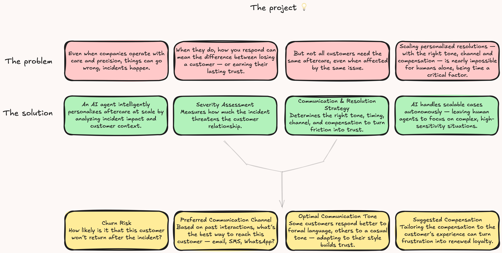
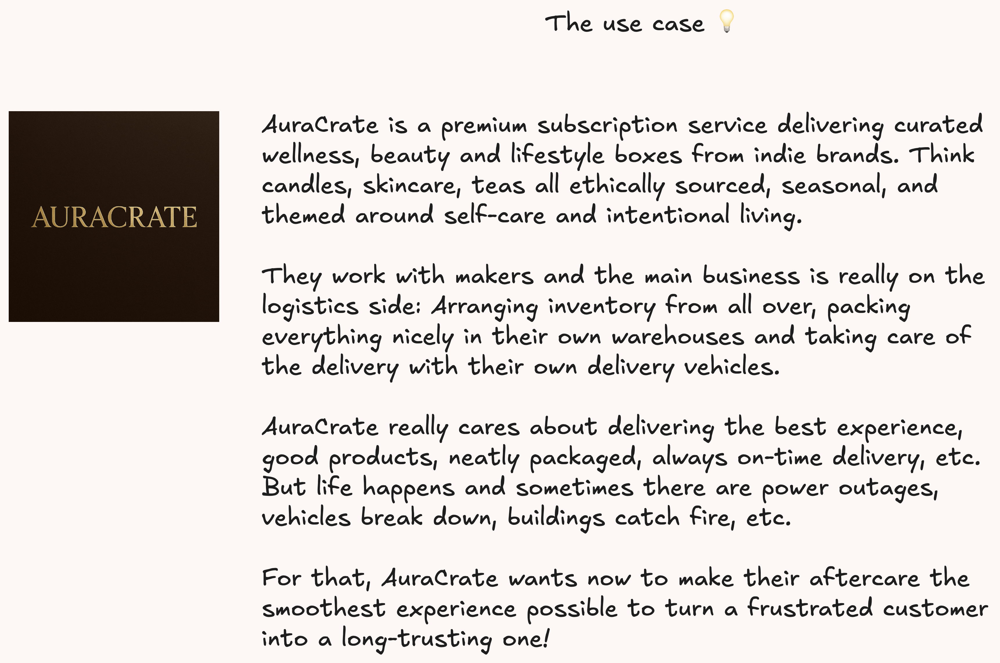
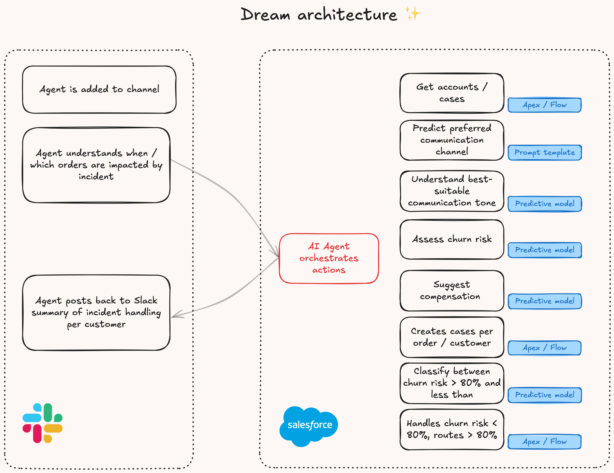
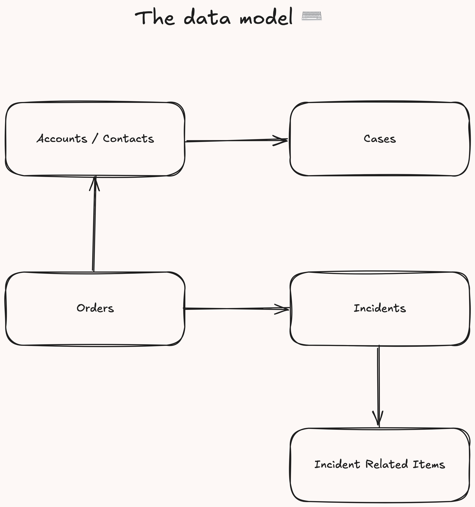
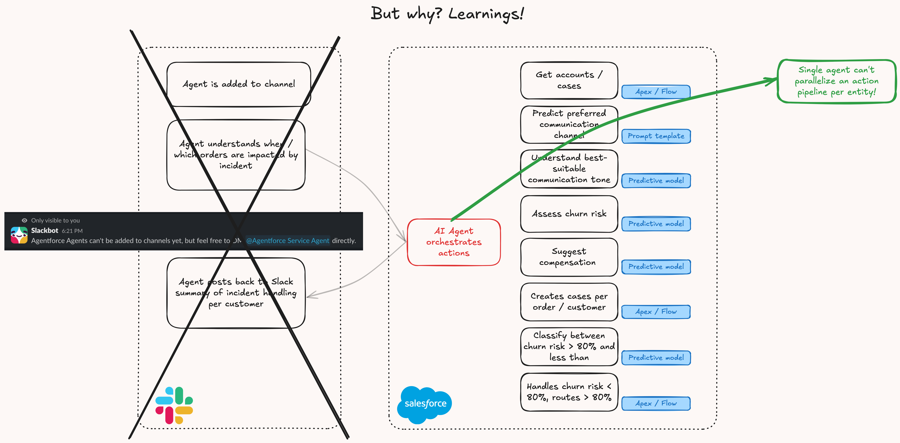

# ⚡️ Agentforce Hackathon 

Now that you’ve created a Salesforce DX project, what’s next? Here are some documentation resources to get you started.

## 🧠 Problem & Solution

## 🔨 Use Case

## 🧩 Target Architecture

## 🗃️ Data Model

## 💡 Learnings 

